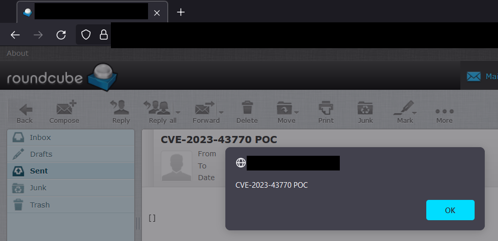

# CVE-2023-43770 POC

A Proof-Of-Concept for the recently found CVE-2023-43770 vulnerability.

Roundcube before 1.4.14, 1.5.x before 1.5.4, and 1.6.x before 1.6.3 allows XSS via text/plain e-mail messages with crafted links because of program/lib/Roundcube/rcube_string_replacer.php behavior.

Usage
----------
```
python cve-2023-43770.py -e attacker@gmail.com -p Attack3rPwd -t victim@example.com
```

Demo
----------


References
----------
https://nvd.nist.gov/vuln/detail/CVE-2023-43770
https://github.com/roundcube/roundcubemail/commit/e92ec206a886461245e1672d8530cc93c618a49b
https://roundcube.net/news/2023/09/15/security-update-1.6.3-released

Disclaimer
----------
This repository is not intended to be a one-click exploit to CVE-2023-43770. The purpose of this project is to help people learn about this vulnerability, and perhaps test their own applications.
